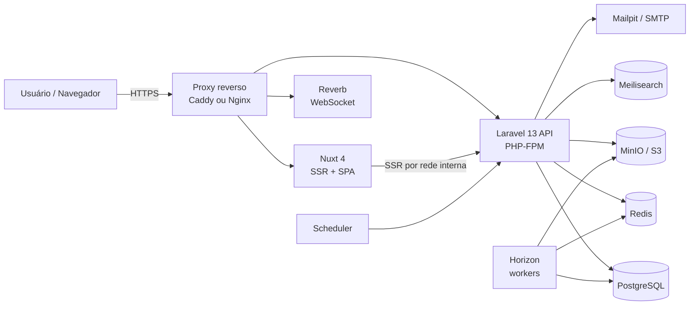
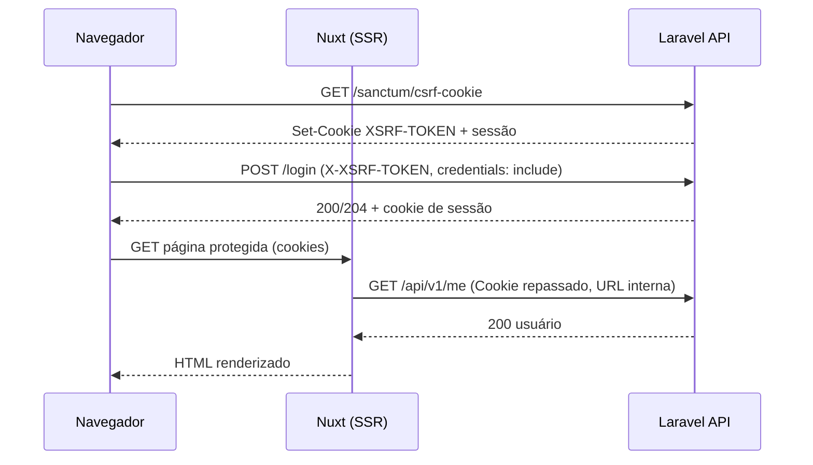
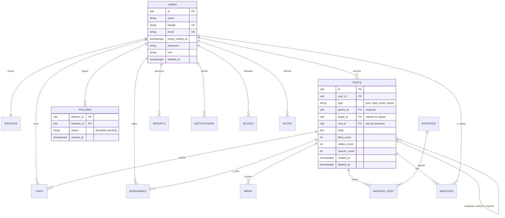

# Clone X

[](https://laravel.com/)
[](https://nuxt.com/)
[](https://tailwindcss.com/)
[](https://www.docker.com/)
[](LICENSE)

# CloneX

> Rede social de microblog inspirada no X (antigo Twitter), construída como **projeto acadêmico** de engenharia de software: API em **Laravel 13**, front-end em **Nuxt 4**, banco **PostgreSQL**, filas e cache em **Redis**, ambiente 100% em **Docker**.

**Status:** em planejamento (Fase 0). Este README é um **documento vivo**: descreve o estado-alvo do projeto e deve ser atualizado a cada fase. Comandos marcados com 🎯 são entregáveis da Fase 0 (ainda a implementar).

> ⚠️ **Aviso:** projeto estritamente educacional, sem afiliação com o X Corp. Use nome, logotipo e identidade visual próprios. Não reutilize marcas ou assets do X.

---

## Sumário

1. [Visão geral](#1-visão-geral)
2. [Escopo](#2-escopo)
3. [Stack tecnológica](#3-stack-tecnológica)
4. [Arquitetura](#4-arquitetura)
5. [Estrutura do repositório](#5-estrutura-do-repositório)
6. [Requisitos](#6-requisitos)
7. [Modelo de dados](#7-modelo-de-dados)
8. [Contrato da API](#8-contrato-da-api)
9. [Pré-requisitos](#9-pré-requisitos)
10. [Início rápido (Docker)](#10-início-rápido-docker)
11. [Scaffolding passo a passo](#11-scaffolding-passo-a-passo)
12. [Variáveis de ambiente](#12-variáveis-de-ambiente)
13. [Serviços em segundo plano](#13-serviços-em-segundo-plano)
14. [Testes](#14-testes)
15. [Qualidade e CI](#15-qualidade-e-ci)
16. [Segurança e LGPD](#16-segurança-e-lgpd)
17. [Desempenho](#17-desempenho)
18. [Observabilidade](#18-observabilidade)
19. [Deploy](#19-deploy)
20. [Roadmap](#20-roadmap)
21. [Fluxo de trabalho](#21-fluxo-de-trabalho)
22. [Troubleshooting](#22-troubleshooting)
23. [Contribuição, licença e créditos](#23-contribuição-licença-e-créditos)

---

## 1. Visão geral

### Objetivos
- Entregar um MVP funcional de rede social (postar, interagir, seguir, timeline, notificações, busca, moderação).
- Demonstrar práticas de engenharia de software: requisitos rastreáveis, modelagem, decisões arquiteturais registradas (ADRs), testes automatizados, CI, segurança e medição de desempenho.
- Usar uma stack atual e defensável, com ambiente reproduzível com um único comando.

### Princípios de projeto
1. **Contrato primeiro:** a API é descrita em OpenAPI; os tipos do front são gerados a partir dela.
2. **Monólito modular:** módulos por domínio no backend, comunicação por eventos e contratos.
3. **Stateless:** sessão, cache e filas no Redis; arquivos em armazenamento de objetos.
4. **Simplicidade primeiro, escala documentada:** começar simples (ex.: timeline por consulta) e registrar o caminho de evolução.
5. **Segurança e privacidade por padrão:** policies em todo recurso, rate limiting, validação, LGPD.
6. **Tudo mensurável:** metas de desempenho e qualidade verificadas em CI.

---

## 2. Escopo

### MVP (obrigatório)
Identidade (cadastro, login, verificação de e-mail, recuperação de senha), perfil, posts de texto com imagem, respostas, curtidas, reposts, salvos, seguidores, timeline "Seguindo", perfil público, notificações, hashtags e menções, busca e moderação básica (denúncias).

### Pós-MVP (desejável, por prioridade)
Notificações em tempo real, 2FA, mensagens diretas, tendências, bloquear/silenciar, perfis privados, citação de post, enquetes, timeline "Para você", busca semântica.

### Fora de escopo
Anúncios, pagamentos/assinaturas, vídeo/streaming, apps nativos, federação (ActivityPub), moderação automatizada por IA.

---

## 3. Stack tecnológica

> Fixe versões exatas em `composer.lock` e `package-lock.json` e confirme as versões vigentes ao iniciar cada fase.

### Backend (`apps/api`)

| Item | Escolha | Observação |
|---|---|---|
| Linguagem | PHP 8.4 | Laravel 13 exige PHP ≥ 8.3 |
| Framework | **Laravel 13** | Versão corrente na data deste documento |
| Autenticação | Laravel **Sanctum** (modo SPA, cookies) + **Fortify** (headless) | Cadastro, verificação de e-mail, reset de senha e 2FA sem views |
| Autorização | Policies e Gates | Spatie Permission apenas se surgirem permissões granulares |
| Banco | **PostgreSQL** | Full-text, índices parciais, JSONB, pgvector (pós-MVP) |
| Cache / sessão / filas | **Redis** (ou Valkey) + **Horizon** | Dashboard de filas |
| Tempo real | **Reverb** | WebSocket nativo (pós-MVP) |
| Busca | **Scout**: driver `database` no MVP → Meilisearch | Troca sem reescrever consultas |
| Mídia | Flysystem S3 (MinIO em dev) | Processamento de imagem em fila |
| Observabilidade | **Pulse** (prod), Telescope (**somente dev**) | + Sentry opcional |
| Testes | **Pest** (sobre PHPUnit) | Paralelo e cobertura |
| Análise estática | **Larastan** (PHPStan) | Nível alto, subir gradualmente |
| Estilo | **Laravel Pint** | |
| Contrato | **Scramble** ou Scribe | Gera OpenAPI a partir do código |

### Frontend (`apps/web`)

| Item | Escolha | Observação |
|---|---|---|
| Framework | **Nuxt 4** (Vue 3) | SSR seletivo por rota |
| Linguagem | **TypeScript** em modo estrito | |
| UI | **Tailwind CSS 4** + **Nuxt UI** | Componentes acessíveis, tema claro/escuro |
| HTTP | `$fetch` / `useFetch` | **Sem Axios** |
| Auth | Módulo Nuxt para Sanctum (ex.: `nuxt-auth-sanctum`) | Cookies + SSR |
| Estado | **Pinia** só para estado global | Dados de servidor via `useAsyncData`/`useFetch` |
| Validação | **Zod** ou **Valibot** | Espelha os Form Requests |
| Ícones | `@nuxt/icon` | Um único conjunto |
| Imagens / fontes | `@nuxt/image`, `@nuxt/fonts` | LCP |
| i18n | `@nuxtjs/i18n` | pt-BR e en |
| Lint | `@nuxt/eslint` | Config flat |
| Testes | Vitest + `@nuxt/test-utils` + **Playwright** | Unit, componente e e2e |
| Tipos da API | `openapi-typescript` | Gerados do OpenAPI |

### Infraestrutura

| Item | Escolha |
|---|---|
| Contêineres | Docker + Docker Compose (perfis) |
| Servidor da API | Nginx + PHP-FPM (Octane/FrankenPHP opcional após medir) |
| Proxy reverso | Caddy, Nginx ou Traefik |
| Armazenamento | MinIO (dev) / S3-compatível (prod) |
| E-mail dev | Mailpit |
| CI/CD | GitHub Actions + Dependabot/Renovate |
| Carga | k6 |
| Qualidade web | Lighthouse CI |

---

## 4. Arquitetura

### 4.1 Visão de contêineres



### 4.2 Backend: monólito modular

Cada módulo é autocontido e expõe somente rotas, eventos e contratos (interfaces).

| Módulo | Responsabilidade |
|---|---|
| `Identity` | Cadastro, login, verificação de e-mail, reset, 2FA, exclusão e exportação de conta |
| `Profiles` | Perfil, avatar, banner, privacidade |
| `Posts` | Posts, respostas, citações, reposts, entidades (hashtags/menções/links) |
| `Interactions` | Curtidas e salvos |
| `Social` | Seguir/deixar de seguir, bloqueios e silenciamentos |
| `Feed` | Timelines (Seguindo, Para você), cache de feed |
| `Notifications` | Notificações no banco, e-mail, broadcast |
| `Media` | Upload, validação, processamento, URLs |
| `Search` | Indexação e consultas, hashtags, tendências |
| `Moderation` | Denúncias, ações de moderação, suspensões |

**Regras de dependência**
- Controllers finos: validam (Form Request), autorizam (Policy), delegam a uma **Action** e devolvem um **API Resource**.
- Módulos **não escrevem** em tabelas de outros módulos; comunicam-se por **Events/Listeners** ou contratos.
- Efeitos colaterais (notificação, contador, indexação, miniaturas) rodam em **Jobs** na fila.
- Fronteiras verificadas por ferramenta de arquitetura (ex.: Deptrac ou PHPArkitect) no CI.

Estrutura-alvo de um módulo:

```
app/Modules/Posts/
├── Actions/            # casos de uso (CreatePost, DeletePost...)
├── Data/               # DTOs/valores de entrada e saída
├── Events/ Listeners/ Jobs/
├── Http/
│   ├── Controllers/ Requests/ Resources/
├── Models/ Policies/
├── routes.php
└── PostsServiceProvider.php
```

### 4.3 Frontend: camadas

```
apps/web/
├── app/
│   ├── components/   # ui/, layout/, post/, profile/, notifications/
│   ├── composables/  # useTimeline, usePost, useFollow, useLike, useInfiniteScroll
│   ├── layouts/      # default, auth
│   ├── middleware/   # auth, guest, verified, admin
│   ├── pages/        # rotas (arquivo = rota)
│   ├── plugins/
│   ├── stores/       # Pinia: sessão, notificações, UI
│   └── utils/
├── server/           # apenas se necessário (ex.: endpoints utilitários)
├── shared/           # tipos gerados, schemas Zod compartilhados
├── i18n/locales/     # pt-BR.json, en.json
└── tests/            # unit/, e2e/
```

**Estratégia de renderização (`routeRules`)**

| Rota | Modo | Motivo |
|---|---|---|
| `/login`, `/register` | SPA/SSR leve | Sem SEO |
| `/@handle`, `/post/:id` | **SSR** + cache curto | SEO e pré-visualização de links |
| `/` (timeline), `/notifications`, `/bookmarks`, `/messages` | **Somente cliente** (autenticadas) | Dados por usuário |
| `/explore`, `/search` | SSR/híbrido | Conteúdo público |
| `/admin/**` | Somente cliente | Restrito |

**Regras:** uma única camada de acesso à API (composables); nada de `fetch` espalhado em componentes; Pinia não duplica cache de servidor; atualização otimista em curtir/seguir/repostar.

### 4.4 Autenticação SPA (Sanctum + Fortify)



Pontos obrigatórios:
- Front e API sob o **mesmo domínio raiz** (dev: `localhost`; prod: ex. `app.exemplo.com` e `api.exemplo.com`).
- `SANCTUM_STATEFUL_DOMAINS` com o host do front; `SESSION_DOMAIN` ajustado; `SESSION_SAME_SITE=lax`; `SESSION_SECURE_COOKIE=true` em produção.
- CORS com `supports_credentials` verdadeiro e **origens explícitas** (sem `*`).
- No SSR, o Nuxt chama a API pela **URL interna** da rede Docker e **repassa os cookies** do navegador.
- Habilitar o middleware stateful da API em `bootstrap/app.php` (`statefulApi()`).
- Fortify em modo **headless** (`views` desativado); habilitar apenas: registro, reset de senha, verificação de e-mail e 2FA (com confirmação).
- Política de senha: mínimo de 10 caracteres e checagem de senha vazada.

### 4.5 Estratégia da timeline

- **MVP: fan-out on read.** A timeline "Seguindo" é uma consulta por cursor sobre posts dos usuários seguidos + próprios, ordenada por `(created_at, id)` decrescente, com limite fixo, índices dedicados e cache curto da primeira página no Redis.
- **Evolução documentada:** abordagem híbrida (fan-out on write em Redis Sorted Sets para contas com poucos seguidores; leitura direta para contas grandes). Só implementar se as medições de carga (Fase 5) indicarem necessidade.
- **Reposts** entram na timeline como itens do tipo repost (ver modelo de dados).
- **Contadores** (curtidas, respostas, reposts) são desnormalizados e atualizados por eventos/jobs.

### 4.6 Registro de decisões (ADRs)

Cada decisão fica em `docs/adr/NNNN-titulo.md` (contexto, decisão, alternativas, consequências).

| ADR | Decisão | Status |
|---|---|---|
| 0001 | Arquitetura desacoplada: Laravel API + Nuxt (alternativas: Inertia, Livewire) | Proposta, confirmar |
| 0002 | PostgreSQL em vez de MySQL | Proposta, confirmar |
| 0003 | Sanctum SPA (cookies) + Fortify headless | Proposta |
| 0004 | Monólito modular com Actions e eventos | Proposta |
| 0005 | Timeline por fan-out on read no MVP | Proposta |
| 0006 | Contrato OpenAPI com tipos gerados | Proposta |
| 0007 | Identificadores ULID | Proposta |
| 0008 | Busca: Scout `database` → Meilisearch | Proposta |
| 0009 | Armazenamento de mídia S3-compatível | Proposta |
| 0010 | Remoção do Axios; Spatie Permission opcional | Proposta |

---

## 5. Estrutura do repositório

```
clonex/
├── apps/
│   ├── api/                  # Laravel 13
│   └── web/                  # Nuxt 4
├── infra/
│   ├── docker/
│   │   ├── api/              # Dockerfile (multi-stage), php.ini, php-fpm, opcache
│   │   ├── web/              # Dockerfile (multi-stage)
│   │   ├── nginx/            # conf do servidor da API
│   │   └── proxy/            # Caddy/Traefik
│   ├── compose/              # arquivos compose por ambiente
│   └── scripts/              # entrypoints, backup, healthchecks
├── docs/
│   ├── requisitos/           # RF/RNF, user stories, matriz de rastreabilidade
│   ├── modelagem/            # C4, sequências, DER, dicionário de dados
│   ├── adr/                  # decisões de arquitetura
│   ├── api/                  # openapi.json exportado
│   └── runbooks/             # deploy, backup, incidentes
├── .github/
│   ├── workflows/            # CI/CD
│   ├── ISSUE_TEMPLATE/
│   └── pull_request_template.md
├── docker-compose.yml        # ambiente de desenvolvimento
├── Makefile                  # 🎯 atalhos de desenvolvimento
├── .editorconfig
├── LICENSE
└── README.md
```

---

## 6. Requisitos

### 6.1 Requisitos funcionais

Prioridade: **M** = Must (MVP), **S** = Should, **C** = Could.

| ID | Requisito | Prior. | Critério de aceite (resumo) |
|---|---|---|---|
| RF01 | Cadastro, login, logout, recuperação de senha, verificação de e-mail | M | Conta nasce não verificada; e-mail de verificação enviado; ações de escrita bloqueadas até verificar; login limitado por tentativas |
| RF02 | Perfil (nome, @handle único, bio, avatar, banner) | M | Handle único sem diferenciar maiúsculas; edição validada; imagem processada em fila |
| RF03 | Criar post (texto até 280 caracteres, até 4 imagens) | M | Contagem por caracteres Unicode; imagens até 5 MB (jpeg, png, webp); post aparece na timeline do autor e dos seguidores |
| RF04 | Excluir e visualizar post | M | Só o autor (ou moderador) exclui; exclusão lógica; página individual com respostas |
| RF05 | Responder, curtir, repostar, salvar | M | Ações idempotentes (repetir não duplica); contadores corretos; desfazer disponível |
| RF06 | Seguir / deixar de seguir | M | Não seguir a si mesmo; listas paginadas; contadores atualizados |
| RF07 | Timeline "Seguindo" | M | Ordem cronológica decrescente; paginação por cursor; sem duplicatas entre páginas |
| RF08 | Perfil público (posts, respostas, mídia) | M | Abas com paginação; posts excluídos não aparecem |
| RF09 | Notificações (curtida, resposta, seguidor, menção) | M | Criadas por evento em fila; marcar como lida (uma e todas); sem notificar ações em si mesmo |
| RF10 | Hashtags e menções | M | Extraídas no servidor; retornadas como entidades com posição; página de hashtag |
| RF11 | Busca de usuários e posts | M | Resultados por relevância e data; paginados; termos sanitizados |
| RF12 | Denúncia e moderação básica | M | Qualquer usuário denuncia; moderador vê fila, resolve e registra ação; papéis: usuário, moderador, admin |
| RF13 | Timeline "Para você" | C | Ranqueamento simples e explicável |
| RF14 | Notificações em tempo real | S | Entrega via WebSocket com fallback ao polling |
| RF15 | Mensagens diretas | C | Conversas 1:1 com bloqueio respeitado |
| RF16 | Tendências por hashtag | C | Janela de tempo configurável, cache |
| RF17 | Bloquear/silenciar, perfil privado | S | Bloqueio remove interações mútuas; privado exige aprovação de seguidor |
| RF18 | Enquetes, citação, múltiplas mídias | C | Conforme especificação posterior |
| RF19 | 2FA (TOTP) | S | Habilitar/desabilitar com confirmação de senha; códigos de recuperação |
| RF20 | Limites e tipos de mídia | M | Tipos reais verificados; metadados removidos; limites configuráveis |

### 6.2 Requisitos não funcionais

Metas **de referência**, a calibrar na Fase 5 com massa de dados definida (ex.: 10 mil usuários, 200 mil posts, 500 mil relações de seguir, 50 usuários virtuais simultâneos).

| ID | Categoria | Requisito | Verificação |
|---|---|---|---|
| RNF01 | Desempenho | Leituras da API com p95 ≤ 300 ms | k6 |
| RNF02 | Desempenho | LCP ≤ 2,5 s e CLS ≤ 0,1 nas páginas públicas | Lighthouse CI |
| RNF03 | Escalabilidade | API stateless, executável com múltiplas instâncias | Teste com 2 réplicas |
| RNF04 | Segurança | Checklist OWASP Top 10 verificado por fase | Revisão + testes |
| RNF05 | Segurança | Rate limiting em endpoints sensíveis | Testes de feature |
| RNF06 | Operação | Um comando sobe o ambiente; healthchecks em todos os serviços | CI |
| RNF07 | Manutenibilidade | Pint, Larastan e ESLint sem erros | CI |
| RNF08 | Testabilidade | Cobertura mínima de 80% nas regras de negócio (Actions/Policies) | CI |
| RNF09 | Observabilidade | Logs estruturados, dashboard de filas, erros rastreados | Revisão |
| RNF10 | Usabilidade | Responsivo; acessibilidade WCAG 2.2 AA nos fluxos principais; tema claro/escuro | Auditoria automatizada + manual |
| RNF11 | Conformidade | LGPD: exclusão e exportação de dados | Teste e2e |
| RNF12 | Portabilidade | Configuração só por variáveis de ambiente | Revisão |
| RNF13 | Contrato | API versionada (`/api/v1`) com OpenAPI como fonte da verdade; sem divergência em CI | CI (diff do OpenAPI) |
| RNF14 | I18n | Interface em pt-BR e en | Testes de componente |
| RNF15 | Reprodutibilidade | Builds com versões travadas | CI |

### 6.3 Rastreabilidade

Manter em `docs/requisitos/matriz-rastreabilidade.md` uma tabela por requisito, ligando:

`RF/RNF → módulo → entidades → endpoints → telas → testes → fase`

Nenhum PR é aceito sem referenciar ao menos um ID de requisito.

---

## 7. Modelo de dados

### 7.1 Convenções

- **IDs:** ULID (ordenável, não enumerável) em todas as entidades principais.
- **Datas:** `timestamptz`, sempre em UTC; formatação no cliente.
- **Exclusão:** lógica (`deleted_at`) em usuários e posts; exclusão física apenas por rotina de retenção/LGPD.
- **Handles e e-mails:** únicos sem diferenciar maiúsculas (índice sobre a forma normalizada).
- **Enumerações:** tipos controlados na aplicação (enums) e `check constraint` no banco.
- **Integridade:** chaves estrangeiras com `on delete` explícito; chaves compostas em tabelas de relação.
- **Migrations** versionadas e reversíveis; **factories e seeders** para todas as entidades.

### 7.2 Diagrama entidade-relacionamento (lógico)



### 7.3 Entidades e responsabilidades

| Entidade | Descrição | Pontos de atenção |
|---|---|---|
| `users` | Conta, credenciais, papel, 2FA (colunas do Fortify) | Papel: `user`, `moderator`, `admin`; suspensão |
| `profiles` | Bio, local, site, privacidade, avatar/banner, contadores de seguidores/seguindo/posts | Contadores desnormalizados |
| `posts` | Post, resposta, citação e repost em uma tabela (`type`) | `body` ≤ 280; repost sem corpo; `root_id` agiliza threads |
| `media` | Arquivos enviados: disco, caminho, mime, tamanho, dimensões, texto alternativo, status de processamento | Associada ao post após a publicação |
| `likes` | (`user_id`, `post_id`) chave composta | Uma curtida por usuário/post |
| `bookmarks` | (`user_id`, `post_id`) | Privado ao usuário |
| `follows` | (`follower_id`, `followee_id`, `status`) | Índice reverso por `followee_id` |
| `hashtags` / `hashtag_post` | Tag normalizada em minúsculas e relação com posts | Alimenta busca e tendências |
| `mentions` | Menções de usuários em posts | Gera notificação |
| `notifications` | Tabela de notificações do Laravel (JSONB em `data`) | Marcação de leitura em lote |
| `reports` | Denúncias (alvo polimórfico, motivo, status, responsável, resolução) | Fila de moderação |
| `blocks` / `mutes` | (`user_id`, `target_id`) | Pós-MVP |
| `audit_logs` | Ações de moderação e administração | Trilha de auditoria |

### 7.4 Índices mínimos (derivados das consultas)

| Consulta | Índice |
|---|---|
| Posts de um perfil | `posts (user_id, created_at desc, id desc)` |
| Timeline "Seguindo" | `follows (follower_id, followee_id)` + índice acima |
| Seguidores de alguém | `follows (followee_id, follower_id)` |
| Respostas de um post | `posts (parent_id, created_at)` |
| Thread completa | `posts (root_id, created_at)` |
| Reposts únicos | Índice único **parcial** em `(user_id, target_id)` quando `type = 'repost'` |
| Posts por hashtag | `hashtag_post (hashtag_id, created_at desc, post_id)` |
| Busca textual | Índice GIN sobre `to_tsvector` (configuração em português) do `body` |
| Handle/e-mail | Únicos sobre a forma normalizada |
| Notificações não lidas | `notifications (notifiable_id, read_at, created_at desc)` |

### 7.5 Contadores e integridade

- Contadores são atualizados por **listeners em fila** (incremento/decremento atômico).
- Rotina agendada de **reconciliação** recalcula contadores a partir das tabelas de relação e corrige divergências.
- Exclusão de post: soft delete, contadores do alvo ajustados e notificações relacionadas removidas.

### 7.6 Retenção e LGPD (dados)

- **Exportação de dados** do titular (JSON/ZIP) gerada em fila.
- **Exclusão de conta:** anonimização imediata do perfil, remoção de mídia e e-mail; exclusão física após período de retenção definido.
- Logs sem dados pessoais desnecessários; senhas apenas com hash.
- **Dicionário de dados** completo em `docs/modelagem/dicionario-de-dados.md`.

---

## 8. Contrato da API

### 8.1 Convenções

- **Base:** `/api/v1`. Mudanças incompatíveis exigem nova versão (`/api/v2`).
- **Formato:** JSON; respostas montadas por **API Resources**; datas em ISO 8601 (UTC).
- **Autenticação:** cookie de sessão (Sanctum SPA) + cabeçalho `X-XSRF-TOKEN` em requisições que alteram estado.
- **Paginação:** por **cursor** (`?limit=20&cursor=...`); resposta com `data` e `meta` contendo `next_cursor`/`prev_cursor`. Nunca offset em listas longas.
- **Erros:** formato único com `message`, `code` (estável, legível por máquina) e, em validação, `errors` por campo.

| HTTP | Uso |
|---|---|
| 200 / 201 / 204 | Sucesso / criado / sem conteúdo |
| 401 | Não autenticado |
| 403 | Autenticado sem permissão (Policy) |
| 404 | Inexistente (ou oculto por privacidade) |
| 409 | Conflito (ex.: handle em uso) |
| 422 | Validação |
| 429 | Rate limit excedido |
| 5xx | Erro do servidor (sem detalhes internos) |

- **Idempotência:** curtir, repostar, salvar e seguir são idempotentes (repetir não gera erro nem duplicata).
- **Entidades de texto:** o post devolve `entities` (hashtags, menções, links) com posições, para o front renderizar sem `v-html`.
- **Documentação:** OpenAPI gerado do código, exportado para `docs/api/openapi.json` e publicado em `/docs/api` (somente dev/staging).

### 8.2 Endpoints do MVP

**Autenticação (rotas do Fortify, sessão; prefixo configurável)**

| Método | Rota | Descrição |
|---|---|---|
| GET | `/sanctum/csrf-cookie` | Inicializa CSRF/sessão |
| POST | `/register` | Cadastro |
| POST | `/login` · `/logout` | Entrar / sair |
| POST | `/forgot-password` · `/reset-password` | Recuperação |
| GET/POST | `/email/verify/{id}/{hash}` · `/email/verification-notification` | Verificação de e-mail |
| POST | `/two-factor-challenge` e rotas `/user/two-factor-*` | 2FA (pós-MVP) |

**Conta e perfil**

| Método | Rota | Descrição |
|---|---|---|
| GET | `/api/v1/me` | Usuário autenticado |
| PATCH | `/api/v1/me/profile` | Editar perfil |
| POST | `/api/v1/me/avatar` · `/me/banner` | Imagens de perfil |
| GET | `/api/v1/me/export` | Solicitar exportação de dados (assíncrono) |
| DELETE | `/api/v1/me` | Excluir conta |
| GET | `/api/v1/users/{handle}` | Perfil público |
| GET | `/api/v1/users/{handle}/posts` · `/replies` · `/media` | Abas do perfil |
| GET | `/api/v1/users/{handle}/followers` · `/following` | Listas |
| POST/DELETE | `/api/v1/users/{handle}/follow` | Seguir / deixar de seguir |

**Posts e interações**

| Método | Rota | Descrição |
|---|---|---|
| POST | `/api/v1/posts` | Criar post/resposta (`parent_id`) |
| GET | `/api/v1/posts/{id}` | Detalhe |
| DELETE | `/api/v1/posts/{id}` | Excluir |
| GET | `/api/v1/posts/{id}/replies` | Respostas (cursor) |
| POST/DELETE | `/api/v1/posts/{id}/like` | Curtir / desfazer |
| POST/DELETE | `/api/v1/posts/{id}/repost` | Repostar / desfazer |
| POST/DELETE | `/api/v1/posts/{id}/bookmark` | Salvar / desfazer |
| GET | `/api/v1/me/bookmarks` | Salvos |
| POST | `/api/v1/media` | Upload de mídia (antes de publicar) |

**Timeline, busca e descoberta**

| Método | Rota | Descrição |
|---|---|---|
| GET | `/api/v1/timeline/following` | Timeline "Seguindo" |
| GET | `/api/v1/timeline/for-you` | Pós-MVP |
| GET | `/api/v1/search?q=&type=posts\|users` | Busca |
| GET | `/api/v1/hashtags/{tag}/posts` | Posts por hashtag |
| GET | `/api/v1/trends` | Tendências (pós-MVP) |

**Notificações e moderação**

| Método | Rota | Descrição |
|---|---|---|
| GET | `/api/v1/notifications` | Listar (cursor) |
| PATCH | `/api/v1/notifications/{id}/read` · POST `/notifications/read-all` | Marcar lidas |
| POST | `/api/v1/reports` | Denunciar |
| GET | `/api/v1/admin/reports` | Fila (moderador/admin) |
| PATCH | `/api/v1/admin/reports/{id}` | Resolver |
| POST | `/api/v1/admin/users/{id}/suspend` | Suspender usuário |

### 8.3 Limites iniciais de taxa (rate limiting)

Valores de partida, a ajustar por observação:

| Ação | Limite |
|---|---|
| Login | 5/min por e-mail + IP |
| Cadastro | 5/hora por IP |
| Criar post/resposta | 30/hora por usuário |
| Seguir/curtir/repostar | 200/hora por usuário |
| Upload de mídia | 20/hora por usuário |
| Busca | 60/min por usuário/IP |
| Leituras gerais | 120/min por usuário/IP |

---

## 9. Pré-requisitos

| Ferramenta | Versão | Uso |
|---|---|---|
| Docker + Docker Compose v2 | Atual | Ambiente de desenvolvimento |
| Git | ≥ 2.40 | Controle de versão |
| Make | Qualquer | Atalhos 🎯 |
| (Opcional) PHP 8.3+ e Composer 2 | Local | Scaffolding fora do Docker |
| (Opcional) Node LTS vigente e npm | Local | Scaffolding fora do Docker |
| (Opcional) k6 | Atual | Testes de carga |

Requisitos mínimos de máquina para o ambiente completo: 8 GB de RAM e ~10 GB de disco livres.

---

## 10. Início rápido (Docker)

> Disponível a partir do final da Fase 0.

### 10.1 Serviços e portas

| Serviço | Porta no host | Perfil | Função |
|---|---|---|---|
| `web` | 3000 | core | Nuxt 4 (dev server) |
| `nginx` | 8000 | core | Servidor HTTP da API |
| `api` | (interna) | core | PHP-FPM / Laravel |
| `horizon` | (interna) | core | Workers de fila |
| `scheduler` | (interna) | core | Tarefas agendadas |
| `postgres` | 5432 | core | Banco de dados (somente dev) |
| `redis` | 6379 | core | Cache, sessão, filas (somente dev) |
| `mailpit` | 8025 (UI) · 1025 (SMTP) | core | Caixa de e-mail de teste |
| `reverb` | 8080 | realtime | WebSocket |
| `meilisearch` | 7700 | search | Busca |
| `minio` | 9000 (API) · 9001 (console) | storage | Armazenamento S3 |

Perfis opcionais: `docker compose --profile search --profile storage --profile realtime up -d`.

### 10.2 Primeira execução

```bash
git clone https://github.com/<seu-usuario>/clonex.git
cd clonex

# 🎯 atalho que executa todos os passos abaixo
make setup
```

Equivalente manual:

```bash
# 1) variáveis de ambiente
cp apps/api/.env.example apps/api/.env
cp apps/web/.env.example apps/web/.env

# 2) imagens e serviços
docker compose up -d --build

# 3) backend
docker compose exec api composer install
docker compose exec api php artisan key:generate
docker compose exec api php artisan migrate --seed
docker compose exec api php artisan storage:link

# 4) frontend (o serviço web já executa o dev server expondo o host 0.0.0.0)
docker compose exec web npm install
```

### 10.3 Acessos

| O quê | URL |
|---|---|
| Aplicação (front) | http://localhost:3000 |
| API | http://localhost:8000/api/v1 |
| Health da API | http://localhost:8000/up |
| Documentação OpenAPI (dev) | http://localhost:8000/docs/api |
| Horizon | http://localhost:8000/horizon |
| Telescope (dev) | http://localhost:8000/telescope |
| Mailpit | http://localhost:8025 |
| MinIO console | http://localhost:9001 |

### 10.4 Atalhos 🎯 (`Makefile`)

| Comando | Ação |
|---|---|
| `make setup` | Primeira instalação completa |
| `make up` · `make down` | Subir / derrubar serviços |
| `make logs s=api` | Logs de um serviço |
| `make sh-api` · `make sh-web` | Shell nos contêineres |
| `make migrate` · `make fresh` | Migrar / recriar banco com seeders |
| `make seed-demo` | Massa grande para testes de carga |
| `make test` · `make test-api` · `make test-web` | Testes |
| `make lint` · `make analyse` | Estilo e análise estática |
| `make openapi` · `make types` | Exportar OpenAPI / gerar tipos do front |

### 10.5 Massa de dados

- `DatabaseSeeder`: poucos usuários fixos (admin, moderador, usuários de demonstração) e dados mínimos para desenvolvimento.
- `DemoSeeder` 🎯: massa realista para carga (ex.: 10 mil usuários, 200 mil posts, 500 mil relações de seguir), executada em lote e em fila.

---

## 11. Scaffolding passo a passo

Roteiro para construir o projeto do zero. Confira a documentação oficial de cada pacote, pois comandos e opções podem mudar entre versões.

### 11.1 Backend

```bash
# projeto
composer create-project laravel/laravel apps/api
cd apps/api

# API + Sanctum
php artisan install:api

# autenticação headless
composer require laravel/fortify
php artisan fortify:install

# filas, painel e monitoramento
composer require laravel/horizon laravel/pulse
php artisan horizon:install
php artisan vendor:publish --provider="Laravel\Pulse\PulseServiceProvider"

# busca
composer require laravel/scout

# tempo real (pós-MVP)
php artisan install:broadcasting

# depuração (somente dev)
composer require laravel/telescope --dev
php artisan telescope:install

# qualidade
composer require --dev pestphp/pest larastan/larastan laravel/pint
./vendor/bin/pest --init

# documentação OpenAPI
composer require dedoc/scramble
```

Ajustes obrigatórios após a instalação:
1. **`bootstrap/app.php`:** habilitar o modo stateful da API (`statefulApi()`) e registrar os providers dos módulos.
2. **`config/sanctum.php` e `.env`:** domínios stateful do front; **`config/cors.php`:** caminhos `api/*` e `sanctum/csrf-cookie`, `supports_credentials` verdadeiro, origem explícita.
3. **`config/fortify.php`:** `views` desativado; features limitadas a registro, reset de senha, verificação de e-mail e 2FA com confirmação.
4. **`User`:** implementar verificação de e-mail e usar ULID.
5. **Banco:** `DB_CONNECTION=pgsql`; extensões necessárias criadas por migration.
6. **`AppServiceProvider`:** em ambientes não produtivos, proibir lazy loading e ativar modo estrito dos models; política de senha (mínimo 10, checagem de vazamento).
7. **Telescope:** registrar apenas em ambiente local; **Horizon/Pulse:** protegidos por gate de administrador.
8. **Rate limiters** nomeados conforme a seção 8.3.

### 11.2 Frontend

```bash
# projeto
npm create nuxt@latest apps/web
cd apps/web

# módulos
npx nuxt module add ui
npx nuxt module add image
npx nuxt module add fonts
npx nuxt module add icon
npx nuxt module add i18n
npx nuxt module add eslint
npx nuxt module add pinia
npx nuxt module add nuxt-auth-sanctum

# validação, testes e geração de tipos
npm i zod
npm i -D vitest @nuxt/test-utils @playwright/test openapi-typescript
npm init playwright@latest
```

Ajustes obrigatórios:
1. **`nuxt.config.ts`:** `typescript.strict`, `routeRules` da seção 4.3, URL pública da API e **URL interna** para SSR (variáveis da seção 12).
2. **Módulo de auth:** configurar origem da API, endpoints (csrf, login, logout, usuário) e proteção de rotas por middleware.
3. **Camada de API:** um único composable base que injeta URL, credenciais e cabeçalho CSRF, e padroniza erros.
4. **Tipos:** `npm run types` gera tipos a partir de `docs/api/openapi.json`.
5. **i18n:** `pt-BR` padrão e `en`.
6. **Segurança de cabeçalhos:** CSP, `Referrer-Policy`, `X-Content-Type-Options`, `Permissions-Policy` (via `routeRules` ou módulo de segurança).

### 11.3 Infraestrutura

1. `infra/docker/api/Dockerfile` multi-stage (dev e prod), extensões PHP necessárias (pdo_pgsql, redis, gd ou imagick, intl, pcntl, opcache) e usuário sem privilégios com UID/GID mapeáveis.
2. `infra/docker/web/Dockerfile` multi-stage (dev com HMR; prod com `nuxt build` e execução do servidor Node gerado).
3. `docker-compose.yml` com perfis, redes separadas (frontend/backend), volumes nomeados, healthchecks e `depends_on` com condição de saúde.
4. `Makefile` com os alvos da seção 10.4.
5. Entrypoints idempotentes (instalam dependências se ausentes, aguardam banco).

---

## 12. Variáveis de ambiente

### 12.1 API (`apps/api/.env`)

| Variável | Exemplo (dev) | Observação |
|---|---|---|
| `APP_ENV` | `local` | `production` em prod |
| `APP_DEBUG` | `true` | **Sempre `false` em prod** |
| `APP_URL` | `http://localhost:8000` | |
| `FRONTEND_URL` | `http://localhost:3000` | Links de e-mail (reset/verificação) |
| `APP_LOCALE` | `pt_BR` | |
| `DB_CONNECTION` | `pgsql` | |
| `DB_HOST` · `DB_PORT` | `postgres` · `5432` | Nome do serviço no Compose |
| `DB_DATABASE` · `DB_USERNAME` · `DB_PASSWORD` | `clonex` · `clonex` · *(secreto)* | |
| `REDIS_HOST` | `redis` | |
| `CACHE_STORE` | `redis` | |
| `SESSION_DRIVER` | `redis` | |
| `SESSION_DOMAIN` | `localhost` | Domínio raiz em prod |
| `SESSION_SAME_SITE` | `lax` | |
| `SESSION_SECURE_COOKIE` | `false` (dev) | `true` em prod |
| `SANCTUM_STATEFUL_DOMAINS` | `localhost:3000` | Hosts do front |
| `QUEUE_CONNECTION` | `redis` | |
| `BROADCAST_CONNECTION` | `reverb` | Pós-MVP |
| `REVERB_APP_ID` · `REVERB_APP_KEY` · `REVERB_APP_SECRET` | *(gerar)* | |
| `REVERB_HOST` · `REVERB_PORT` · `REVERB_SCHEME` | `localhost` · `8080` · `http` | |
| `SCOUT_DRIVER` | `database` | `meilisearch` na evolução |
| `MEILISEARCH_HOST` · `MEILISEARCH_KEY` | `http://meilisearch:7700` · *(secreto)* | |
| `FILESYSTEM_DISK` | `s3` | |
| `AWS_ACCESS_KEY_ID` · `AWS_SECRET_ACCESS_KEY` | *(secreto)* | Credenciais do MinIO/S3 |
| `AWS_BUCKET` · `AWS_DEFAULT_REGION` | `clonex` · `us-east-1` | |
| `AWS_ENDPOINT` · `AWS_USE_PATH_STYLE_ENDPOINT` | `http://minio:9000` · `true` | Apenas MinIO |
| `MAIL_MAILER` · `MAIL_HOST` · `MAIL_PORT` | `smtp` · `mailpit` · `1025` | |
| `MAIL_FROM_ADDRESS` | `no-reply@clonex.local` | |
| `LOG_CHANNEL` | `stderr` | Logs para o stdout/stderr do contêiner |
| `TELESCOPE_ENABLED` | `true` (dev) | **`false` em prod** |

### 12.2 Web (`apps/web/.env`)

| Variável | Exemplo (dev) | Observação |
|---|---|---|
| `NUXT_PUBLIC_API_URL` | `http://localhost:8000` | URL usada pelo **navegador** |
| `NUXT_API_INTERNAL_URL` | `http://nginx:8000` | URL usada pelo **SSR** dentro da rede Docker |
| `NUXT_PUBLIC_SITE_URL` | `http://localhost:3000` | Links absolutos e metadados |
| `NUXT_PUBLIC_REVERB_KEY` · `NUXT_PUBLIC_REVERB_HOST` · `NUXT_PUBLIC_REVERB_PORT` | *(conforme API)* | Pós-MVP |

### 12.3 Regras

- `.env` **nunca** é versionado; somente `.env.example` sem valores reais.
- Segredos de produção ficam no gerenciador de segredos da plataforma.
- Valores obrigatórios são validados na inicialização (falha rápida com mensagem clara).
- Dev e produção diferem em: debug, cookies seguros, credenciais, portas expostas, drivers (mail/storage) e ferramentas (Telescope).

---

## 13. Serviços em segundo plano

### 13.1 Filas (Horizon)

| Fila | Conteúdo | Prioridade |
|---|---|---|
| `critical` | E-mails de verificação/reset | Alta |
| `default` | Contadores, notificações, indexação | Média |
| `media` | Redimensionar, converter e limpar metadados de imagens | Baixa |
| `exports` | Exportação de dados (LGPD) | Baixa |

Requisitos: jobs **idempotentes**, com `tries`/`backoff`, tratamento de falha e fila de jobs com falha monitorada. Após cada deploy, reiniciar os workers (`php artisan horizon:terminate`).

### 13.2 Agendador

| Tarefa | Frequência | Objetivo |
|---|---|---|
| Reconciliação de contadores | Diária | Corrigir divergências |
| Limpeza de mídia órfã | Diária | Remover uploads não vinculados |
| Remoção física por retenção | Diária | LGPD |
| Poda de notificações antigas | Semanal | Controlar volume |
| Cálculo de tendências | A cada 15 min | Cache de trends (pós-MVP) |
| Limpeza de dados do Horizon/Pulse/Telescope | Conforme pacote | Evitar crescimento |

### 13.3 Tempo real (pós-MVP)

- Canais privados por usuário para notificações; autorização do canal via sessão Sanctum.
- Cliente com reconexão automática e **fallback para polling** curto.
- Em produção, WebSocket atrás do proxy reverso com TLS (`wss`).

### 13.4 Busca

- **MVP:** Scout com driver `database` (e índice full-text em português no PostgreSQL) para usuários e posts.
- **Evolução:** Meilisearch com indexação em fila; reindexação por comando; sinônimos e tolerância a erros de digitação.
- **Pós-MVP:** busca semântica com pgvector (embeddings), mantendo o contrato da rota `/search`.

### 13.5 Mídia

Fluxo: upload → validação (tipo real, tamanho, dimensões) → armazenamento temporário → job de processamento (reencode para formato otimizado, remoção de EXIF, miniaturas) → vínculo ao post → URLs públicas via CDN ou assinadas. Arquivos recebem nomes aleatórios; nada enviado é executado ou servido com o tipo declarado pelo cliente.

---

## 14. Testes

### 14.1 Pirâmide

| Nível | Ferramenta | O que cobre | Meta |
|---|---|---|---|
| Unitário | Pest | Actions, regras de domínio, Policies | ≥ 80% de cobertura nessas camadas |
| Feature/integração (API) | Pest + banco de teste | Rotas, validação, autorização, filas (fakes), eventos | Todos os endpoints do MVP |
| Contrato | Diff do OpenAPI | Divergência entre código e `openapi.json` | Zero divergência |
| Componente (web) | Vitest + `@nuxt/test-utils` | Componentes, composables, stores | Componentes críticos |
| E2E | Playwright | Cadastro/login, postar, curtir, seguir, timeline, notificações, exclusão de conta | Fluxos críticos |
| Carga | k6 | Timeline, criação de post, busca, login | Metas RNF01 |
| Acessibilidade/performance | Lighthouse CI + axe | Páginas públicas e fluxos principais | RNF02, RNF10 |

### 14.2 Comandos

```bash
# API
docker compose exec api ./vendor/bin/pest                 # todos os testes
docker compose exec api ./vendor/bin/pest --parallel      # em paralelo
docker compose exec api ./vendor/bin/pest --coverage --min=80
docker compose exec api ./vendor/bin/phpstan analyse      # análise estática
docker compose exec api ./vendor/bin/pint --test          # verificar estilo

# Web
docker compose exec web npm run test                      # Vitest
docker compose exec web npm run test:e2e                  # Playwright
docker compose exec web npm run lint
docker compose exec web npm run typecheck

# Carga (a partir do host)
k6 run infra/k6/timeline.js
```

### 14.3 Convenções

- Testes de feature usam banco dedicado (refresh a cada teste) e **factories**; sem dependência de ordem.
- Cada requisito (RF/RNF) tem ao menos um teste nomeado com seu ID.
- Autorização: para cada endpoint, testar usuário anônimo, outro usuário, dono, moderador e admin.
- Filas, e-mail, notificações e storage são **simulados** em testes de feature e exercitados de verdade nos e2e.
- Testes flaky são corrigidos ou removidos; nunca ignorados.

---

## 15. Qualidade e CI

### 15.1 Ferramentas

| Camada | Ferramenta | Regra |
|---|---|---|
| PHP (estilo) | Pint | Sem violações |
| PHP (análise) | Larastan | Começar em nível intermediário e subir gradualmente |
| PHP (arquitetura) | Deptrac ou PHPArkitect | Respeitar dependências entre módulos |
| PHP (dependências) | `composer audit` | Sem vulnerabilidades altas/críticas |
| Web (estilo/lint) | `@nuxt/eslint` | Sem erros |
| Web (tipos) | `nuxt typecheck` | Sem erros |
| Web (dependências) | `npm audit` | Sem vulnerabilidades altas/críticas |
| Geral | EditorConfig, hooks de pré-commit (Husky/lefthook) | Lint e testes rápidos antes do commit |

### 15.2 Pipeline (GitHub Actions)

| Estágio | Conteúdo | Bloqueia merge |
|---|---|---|
| 1. Lint e estática | Pint, Larastan, ESLint, typecheck | Sim |
| 2. Testes da API | Pest com serviços PostgreSQL e Redis, cobertura mínima | Sim |
| 3. Testes do web | Vitest | Sim |
| 4. Contrato | Gerar OpenAPI e comparar com `docs/api/openapi.json`; regenerar tipos e comparar | Sim |
| 5. Segurança | `composer audit`, `npm audit`, varredura de imagens/segredos | Sim (alta/crítica) |
| 6. Build | Imagens Docker de produção | Sim |
| 7. E2E | Playwright contra o ambiente Compose | Sim (fluxos críticos) |
| 8. Qualidade web | Lighthouse CI com orçamento de desempenho | Aviso → bloqueio na Fase 5 |
| 9. Release | Tag semântica por fase, publicação de imagens, changelog | Manual |

Cache de dependências habilitado; execuções paralelas quando possível; atualizações automáticas de dependências (Dependabot/Renovate) com PRs pequenos.

---

## 16. Segurança e LGPD

### 16.1 Checklist por categoria (OWASP Top 10)

| Risco | Controles no projeto |
|---|---|
| Controle de acesso quebrado | Policies em **todos** os recursos; testes por papel; IDs não sequenciais (ULID); respostas 404 para recursos ocultos |
| Falhas criptográficas | HTTPS e HSTS em produção; cookies `Secure`/`HttpOnly`/`SameSite`; senhas com hash do framework; segredos fora do repositório |
| Injeção | Eloquent/Query Builder com binding; validação por Form Requests; nunca concatenar entrada em SQL; busca com termos sanitizados |
| XSS | Texto de posts armazenado como texto simples; renderização escapada (sem `v-html`); entidades estruturadas; CSP restritiva |
| Design inseguro | Modelagem de ameaças simples (STRIDE) por módulo; rate limiting; fluxo de denúncia/bloqueio |
| Configuração incorreta | `APP_DEBUG=false` em prod; Telescope desativado em prod; Horizon/Pulse atrás de gate; portas de banco/Redis não expostas em prod; cabeçalhos de segurança |
| Componentes vulneráveis | Auditoria no CI; atualização automática; imagens com tags fixas e varredura |
| Falhas de autenticação | Limite de tentativas; verificação de e-mail; senha forte e checagem de vazamento; 2FA; invalidar sessão na troca de senha |
| Falhas de integridade | Lockfiles; builds reproduzíveis; revisão de PRs; proteção de branch |
| Registro e monitoramento | Logs estruturados sem dados sensíveis; auditoria de ações de moderação; alertas de erro |
| SSRF | Nenhuma busca de URL arbitrária no servidor (pré-visualização de links, se houver, com lista de bloqueio de redes internas) |

### 16.2 Segurança de uploads

- Validar o **tipo real** do arquivo (não só extensão ou cabeçalho declarado), tamanho e dimensões.
- Reencodar imagens (elimina payloads embutidos e metadados EXIF/GPS).
- Nomes aleatórios; armazenar fora do diretório executável; bucket sem listagem pública.
- Limites por usuário e por requisição; limpeza de órfãos.

### 16.3 Segurança de infraestrutura

- Contêineres sem root, sistema de arquivos mínimo, imagens base fixadas por versão.
- Redes Docker separadas; Postgres e Redis acessíveis apenas na rede interna em produção.
- Backups criptografados; chaves rotacionáveis; princípio do menor privilégio nas credenciais.

### 16.4 LGPD

| Requisito | Implementação |
|---|---|
| Finalidade e base legal | Política de privacidade e termos de uso; registro do consentimento no cadastro |
| Minimização | Coletar apenas dados necessários; sem rastreadores de terceiros por padrão |
| Direito de acesso/portabilidade | Exportação de dados (`/me/export`) |
| Direito de eliminação | Exclusão de conta com anonimização imediata e remoção física após retenção |
| Segurança | Controles das seções 16.1–16.3 |
| Incidentes | Runbook de resposta a incidentes em `docs/runbooks/` |
| Retenção | Prazos documentados por tipo de dado (logs, mídia, notificações) |

---

## 17. Desempenho

### 17.1 Orçamentos (RNF01 e RNF02)

| Métrica | Meta de referência |
|---|---|
| Latência p95 de leituras da API | ≤ 300 ms |
| Latência p95 de escritas (post, curtir) | ≤ 500 ms |
| Taxa de erro sob carga | < 1% |
| LCP / CLS (páginas públicas) | ≤ 2,5 s / ≤ 0,1 |
| JavaScript inicial | Orçamento definido na Fase 5 e verificado no CI |

### 17.2 Backend

- **N+1:** bloquear lazy loading fora de produção; *eager loading* explícito em listagens.
- **Consultas:** selecionar apenas colunas necessárias; paginação por cursor; índices da seção 7.4; revisar planos de execução das consultas críticas.
- **Cache:** perfis, contadores e primeira página de timeline no Redis, com invalidação por evento.
- **Filas:** tudo que não precisa ser síncrono.
- **Produção:** otimizações do framework (cache de configuração, rotas, eventos e views), OPcache ajustado, workers dimensionados.
- **Opcional:** Octane/FrankenPHP **somente após medir** que o ganho justifica a complexidade.

### 17.3 Frontend

- `routeRules` por rota (SSR, cache, somente cliente) e hidratação preguiçosa em blocos pesados.
- Scroll infinito com **virtualização** em listas longas e atualização otimista.
- Imagens responsivas, lazy e em formato moderno (`@nuxt/image`); fontes locais com `font-display`.
- Divisão de código por rota; evitar dependências grandes sem necessidade.
- Cabeçalhos de cache para assets estáticos com hash.

### 17.4 Procedimento de medição

1. Popular o banco com `make seed-demo`.
2. Executar cenários k6 (login, timeline, criar post, curtir, busca) com perfis de carga progressivos.
3. Coletar métricas (latência, erros, uso de CPU/memória, filas, consultas lentas).
4. Registrar resultados em `docs/desempenho/` com data, versão e configuração; comparar entre fases.
5. Só otimizar com evidência; cada otimização relevante vira um registro (ADR ou nota técnica).

---

## 18. Observabilidade

| Necessidade | Ferramenta | Ambiente |
|---|---|---|
| Health checks | Rota nativa `/up` + healthchecks do Compose | Todos |
| Filas | Horizon | Todos (protegido) |
| Métricas da aplicação | Pulse | Prod/staging (protegido) |
| Depuração detalhada | Telescope | **Apenas dev** |
| Erros | Sentry (ou equivalente) | Staging/prod |
| Logs | JSON estruturado em stderr, com correlação por ID de requisição | Todos |
| Desempenho web | Lighthouse CI | CI |

Regras: nenhum dado pessoal em logs; alertas para falha de fila, taxa de erro e indisponibilidade; painéis protegidos por gate de administrador.

---

## 19. Deploy

### 19.1 Visão geral

- Dois artefatos: imagem da **API** (PHP-FPM) e imagem do **web** (Nuxt servido por Node), mais workers/scheduler/Reverb com a mesma imagem da API.
- Ambientes: `dev` (local), `staging` (opcional) e `prod` (demonstração).
- Opções de hospedagem: VPS com Compose e plataforma de deploy (ex.: Coolify ou Dokploy), ou serviços gerenciados (API e front em plataformas distintas). Confira preços e planos vigentes antes de decidir.

### 19.2 Diferenças dev × prod

| Aspecto | Dev | Prod |
|---|---|---|
| Debug | Ligado | **Desligado** |
| Cookies | Sem `Secure` | `Secure`, domínio raiz |
| Telescope | Ligado | Desligado |
| Portas de DB/Redis | Expostas no host | **Somente rede interna** |
| Armazenamento | MinIO | S3-compatível gerenciado |
| E-mail | Mailpit | SMTP real |
| Código | Volume montado, HMR | Imagem imutável |
| Otimizações Laravel | Não | Sim (config/rotas/eventos em cache) |

### 19.3 Procedimento de release

1. Pipeline verde na `main`; criar tag semântica da fase.
2. Construir e publicar imagens versionadas.
3. Fazer **backup** do banco antes de migrar.
4. Aplicar migrations (`php artisan migrate --force`) e otimizações do framework.
5. Reiniciar workers (`horizon:terminate`) e demais serviços de longa duração.
6. Validar `/up`, fluxo de login e uma operação de escrita; monitorar erros por alguns minutos.
7. Em caso de falha: reverter para a imagem anterior e, se necessário, restaurar o backup (migrations devem ser reversíveis ou aditivas).

### 19.4 Checklist de produção

- [ ] HTTPS com renovação automática de certificado
- [ ] `APP_DEBUG=false`, `TELESCOPE_ENABLED=false`
- [ ] Segredos no gerenciador da plataforma (nenhum no repositório)
- [ ] Postgres/Redis sem exposição pública
- [ ] Backup automático do Postgres testado com **restauração real**
- [ ] Persistência do Redis configurada (para filas)
- [ ] Armazenamento de mídia com versionamento ou backup
- [ ] Horizon, Pulse e docs da API atrás de autenticação
- [ ] Cabeçalhos de segurança verificados
- [ ] Rate limiting ativo e testado
- [ ] Alertas de erro e de falha de fila configurados
- [ ] Política de privacidade e termos publicados

---

## 20. Roadmap

Marque os itens conforme concluir. Cada fase só termina quando atende ao **critério de saída**.

### Fase 0: Fundação
- [ ] Repositório, estrutura, EditorConfig, templates de issue/PR
- [ ] Docker Compose (perfis), Dockerfiles multi-stage, healthchecks, Makefile
- [ ] Laravel 13 e Nuxt 4 criados; ADRs 0001–0010 revisados
- [ ] CI básico (lint, estática, testes de exemplo)
- [ ] Contrato OpenAPI base e geração de tipos
- [ ] Documentação inicial: requisitos, matriz de rastreabilidade, DER lógico
- **Saída:** um comando sobe tudo; CI verde.

### Fase 1: Identidade e perfil
- [ ] RF01, RF02, RF20 (parte de avatar/banner)
- [ ] Fluxo de login SPA com SSR validado ponta a ponta
- [ ] E-mails de verificação e reset (Mailpit)
- **Saída:** cadastro → verificação → login → edição de perfil, com testes e2e.

### Fase 2: Posts e interações
- [ ] RF03, RF04, RF05, RF10 (entidades)
- [ ] Upload e processamento de mídia
- [ ] Contadores por eventos e reconciliação
- **Saída:** postar, responder, curtir, repostar, salvar, com Policies testadas.

### Fase 3: Grafo social e timeline
- [ ] RF06, RF07, RF08
- [ ] Índices e cursor; cache da primeira página; `DemoSeeder`
- **Saída:** timeline estável com a massa de dados de referência.

### Fase 4: Notificações, busca e moderação
- [ ] RF09, RF11, RF12, páginas de hashtag
- [ ] Painel mínimo de moderação e auditoria
- **Saída:** **MVP completo** (RF01–RF12 e RF20).

### Fase 5: Endurecimento
- [ ] Checklist OWASP e LGPD completos
- [ ] Testes de carga k6, ajustes e relatório de desempenho
- [ ] Observabilidade em produção; acessibilidade AA nos fluxos principais
- **Saída:** metas dos RNF verificadas e documentadas.

### Fase 6: Evolução e entrega
- [ ] Item(ns) pós-MVP escolhido(s): tempo real, 2FA, DMs, tendências ou busca semântica
- [ ] Documentação final: arquitetura, ADRs finais, manual de operação, relatório do projeto
- [ ] Deploy de demonstração
- **Saída:** release `v1.0.0`.

---

## 21. Fluxo de trabalho

### 21.1 Processo

- Kanban ou Scrum enxuto, sprints de 1 a 2 semanas; backlog derivado da matriz de rastreabilidade.
- **Definition of Ready:** história com critério de aceite, requisitos referenciados e dependências claras.
- **Definition of Done:**
  - [ ] Código revisado e mesclado via PR
  - [ ] Testes novos e existentes passando; cobertura dentro da meta
  - [ ] Pint, Larastan, ESLint e typecheck sem erros
  - [ ] OpenAPI e tipos atualizados (sem divergência)
  - [ ] Segurança: Policy, validação e rate limit revisados
  - [ ] Documentação e matriz de rastreabilidade atualizadas
  - [ ] Sem segredos nem dados pessoais em código/logs

### 21.2 Git

- Desenvolvimento baseado em tronco: `main` protegida; ramos curtos a partir dela.
- Nomes de ramo: `feat/RF05-curtir-post`, `fix/RF07-cursor-duplicado`, `docs/adr-0002`, `chore/ci-cache`.
- **Commits convencionais:** `feat:`, `fix:`, `docs:`, `refactor:`, `test:`, `chore:`, `perf:`, `ci:`, com escopo opcional (ex.: `feat(posts): curtir post`).
- PRs pequenos, com descrição, requisitos referenciados (RF/RNF), evidências (prints, testes) e checklist de DoD.
- Merge por *squash*; versões marcadas com tags semânticas por fase.

### 21.3 Modelo de PR (`.github/pull_request_template.md`)

```markdown
## O que muda
## Requisitos relacionados (RF/RNF)
## Como testar
## Checklist
- [ ] Testes
- [ ] Lint/estática/typecheck
- [ ] OpenAPI e tipos atualizados
- [ ] Policies/validação/rate limit revisados
- [ ] Documentação atualizada
```

---

## 22. Troubleshooting

| Sintoma | Causa provável | Ação |
|---|---|---|
| `419 CSRF token mismatch` | Cookie CSRF não obtido ou cabeçalho ausente | Chamar `/sanctum/csrf-cookie` antes do login; enviar `X-XSRF-TOKEN`; usar `credentials: include`; conferir `SANCTUM_STATEFUL_DOMAINS` |
| Login funciona, mas `/me` retorna 401 | Domínio/`SameSite` do cookie ou cookies não repassados no SSR | Conferir `SESSION_DOMAIN`, `SESSION_SAME_SITE`; no SSR, repassar o cabeçalho `Cookie` à API |
| Erro de CORS | Origem não permitida ou credenciais desativadas | `supports_credentials` verdadeiro; origem explícita (sem `*`); incluir `sanctum/csrf-cookie` nos caminhos |
| SSR não alcança a API no contêiner | `localhost` aponta para o próprio contêiner | Usar `NUXT_API_INTERNAL_URL` com o nome do serviço |
| Nuxt inacessível do host | Dev server escutando só em loopback | Executar com host `0.0.0.0` (`npm run dev -- --host 0.0.0.0`) |
| Erros de permissão em `storage/` | UID/GID do contêiner diferente do host | Mapear UID/GID no Dockerfile/Compose; ajustar donos de `storage` e `bootstrap/cache` |
| Jobs não são processados | Worker parado ou fila errada | Ver Horizon; confirmar serviço `horizon`; `QUEUE_CONNECTION=redis` |
| Mudanças de código sem efeito nos workers | Workers carregam o código na inicialização | `php artisan horizon:terminate` |
| Porta em uso (5432, 6379, 8000, 3000) | Serviço local conflitante | Parar o serviço local ou alterar o mapeamento de porta no Compose |
| HMR não atualiza atrás do proxy | WebSocket do Vite bloqueado | Configurar host/porta do HMR e permitir upgrade de WebSocket no proxy |
| `wss` falha em produção | Proxy sem suporte a WebSocket ou TLS | Habilitar upgrade de conexão e certificado válido para o host do Reverb |
| Timeline lenta | Falta de índice, N+1 ou cache | Analisar plano da consulta, `preventLazyLoading`, índices da seção 7.4, cache da primeira página |
| Upload rejeitado | Tipo/tamanho fora do limite ou limite do PHP/proxy | Conferir regras de validação, `upload_max_filesize`, `post_max_size` e limite do proxy |

---

## 23. Contribuição, licença e créditos

### Contribuição
1. Abra uma issue descrevendo o requisito ou o problema (com ID de RF/RNF).
2. Crie um ramo conforme a seção 21.2.
3. Garanta que lint, análise estática e testes passam localmente (`make lint analyse test`).
4. Abra um PR usando o modelo e aguarde revisão e CI verde.

### Documentação complementar
- Requisitos e rastreabilidade: `docs/requisitos/`
- Modelagem (C4, sequências, DER, dicionário de dados): `docs/modelagem/`
- Decisões de arquitetura: `docs/adr/`
- Contrato da API: `docs/api/openapi.json`
- Operação e incidentes: `docs/runbooks/`

### Licença
Distribuído sob a licença **MIT**. Veja o arquivo `LICENSE`.

### Créditos
Projeto acadêmico. Laravel, Nuxt, Vue, Tailwind CSS, PostgreSQL, Redis e demais ferramentas pertencem aos seus respectivos autores e comunidades. "X" e "Twitter" são marcas de seus titulares; este projeto não possui vínculo com elas.
